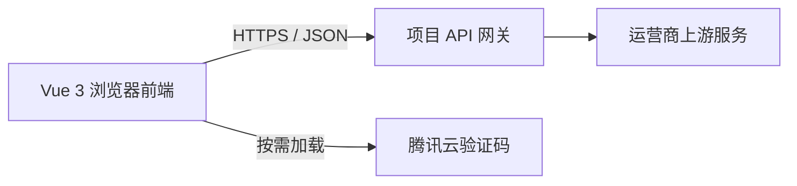

# 余量面板

基于 Vue 3 的中国联通套餐余量查询与网络测速面板，用于查看流量、语音、短信、签约速率、QCI、限速服务状态及当前网络速度。

- [在线体验](https://net.2t.hk/)
- [下载预构建静态文件](https://aliya-chen.github.io/unicomvue/dist.zip)
- [提交问题或建议](https://github.com/AliYa-chen/unicomvue/issues)

> 本服务独立提供联通账号信息查询与展示，不代表运营商官方业务办理渠道。用户应仅查询本人或已获合法授权的账号，并遵守运营商服务规则；查询结果以中国联通官方系统和正式账单为准。

## 功能

- 支持手机号、短信验证码及安全验证登录
- 支持直接使用 `ecs_token` 登录
- 支持多账号保存、切换和移除
- 余量设置可关闭账号本地保存、自动刷新，并选择页面强调色
- 展示套餐名称、流量、语音及短信余量
- 展示签约速率、QCI 和限速服务状态
- 默认每 30 秒自动刷新，并可在设置中关闭
- 支持浅色、深色及跟随系统主题
- 支持动态 Canvas 背景和截图分享
- 支持底部液态玻璃风格导航，在余量与测速页面之间切换
- 支持多节点、自定义文件地址及 1–64 线程的持续下载测速，运行中可即时切换
- 应用管理的账号状态保存在当前浏览器的 `localStorage`

## 技术栈

- Vue 3 Composition API
- Vite 8
- Tailwind CSS 4
- pnpm
- ESLint 与 Oxlint

## 项目结构

```text
src/
├── components/       # 按 app、auth、dashboard、privacy 分类的界面组件
├── composables/      # Vue 生命周期与可复用交互状态
├── config/           # 应用常量与接口配置
├── domain/           # 与界面无关的数据规范化和业务规则
├── services/         # API、本地存储及登录身份服务
├── stores/           # 跨组件业务状态
├── utils/            # 无状态通用工具
└── views/            # 页面级组合层
```

## 接口、隐私与免责声明

本项目提供基于 Vue 3 的浏览器前端，服务端为账号登录、安全验证和信息查询提供支持。前端通过公开 API 完成登录与查询，并在需要安全验证时按需加载腾讯云验证码组件；服务端技术与安全配置按内部规范管理。



完整接口清单、服务说明与免责声明、数据流、Cookie 与 Token 说明统一维护在 [接口、隐私与免责声明](./docs/api-and-privacy.md)。应用内的“隐私 / Cookie / Token 说明”模态框也直接使用这份 Markdown，避免文档与界面内容不一致。

## 本地开发

### 环境要求

- Node.js `^20.19.0`、`^22.13.0` 或 `>=24.0.0`
- pnpm `10.34.5`

推荐通过 Corepack 使用项目声明的 pnpm 版本：

```bash
corepack enable
corepack prepare pnpm@10.34.5 --activate
```

### 安装与启动

```bash
git clone https://github.com/AliYa-chen/unicomvue.git
cd unicomvue
pnpm install --frozen-lockfile
pnpm dev
```

开发服务器默认运行在 `http://localhost:5173/`。默认 API 地址为远程公开网关；自定义部署域名仍需满足网关的跨域策略。

### 检查与构建

```bash
pnpm check
pnpm preview
```

生产构建输出位于 `dist/`。

## 部署

### 静态文件

执行 `pnpm run build` 后，将 `dist/` 中的文件部署到任意静态站点服务。不了解 Vite 构建流程时，也可以直接下载已经构建好的 [dist.zip](https://aliya-chen.github.io/unicomvue/dist.zip)。

### Docker

直接运行已发布镜像：

```bash
docker run -d --rm --name network-panel -p 8080:80 bingoma/network-panel:latest
```

浏览器访问 `http://localhost:8080/`。

从源码构建镜像时，当前 `Dockerfile` 会复制已有的 `dist/`，因此必须先完成前端构建：

```bash
pnpm install --frozen-lockfile
pnpm run build
docker build -t network-panel:local .
docker run --rm -p 8080:80 network-panel:local
```

### EdgeOne Pages

[](https://edgeone.ai/pages/new?repository-url=https%3A%2F%2Fgithub.com%2FAliYa-chen%2Funicomvue)

## 常见问题

### 自建页面可以加入跨域白名单吗？

可以申请，但需要满足以下条件：

- 页面已有明确的实际使用场景
- 页面中保留指向本项目开源仓库的链接
- 不用于商业用途、批量请求或接口滥用

请通过 [GitHub Issues](https://github.com/AliYa-chen/unicomvue/issues) 联系项目维护者，是否加入白名单将根据实际情况评估。

### 可以增加新功能吗？

欢迎通过 [GitHub Issues](https://github.com/AliYa-chen/unicomvue/issues) 提交具体使用场景、预期行为和必要性。功能是否实现将根据维护成本和实际价值评估。

## 联系方式

- GitHub Issues：[AliYa-chen/unicomvue](https://github.com/AliYa-chen/unicomvue/issues)

## 许可证

本项目使用 [MIT License](./LICENSE)。
